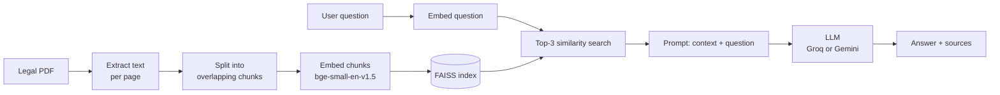

# ⚖️ Legal RAG Assistant


Ask questions about a legal PDF in plain English and get answers that are **grounded in the document itself**, with the source page shown next to every answer.

Upload a contract, lease or agreement, and the assistant finds the passages that matter, hands them to an LLM, and answers using only that text. If the document doesn't contain the answer, it says so instead of guessing.

## Features

- **Upload any text-based PDF** (contracts, leases, NDAs, policies) and start asking questions right away.
- **Answers grounded in your document.** The model is instructed to use only the retrieved text and to admit when the answer isn't there.
- **Source transparency.** Every answer lists the file and page it came from, and the retrieved passages can be expanded and read.
- **Two ways to use it.** A Streamlit web app and an interactive command-line chat.
- **Fast after the first question.** The PDF is indexed once per upload, and the vector index and embedding model are cached in memory.
- **Runs the retrieval side locally.** Embeddings and vector search run on your machine, and only the retrieved passages are sent to the LLM.

## How It Works



1. **Indexing** (`rag_index_builder.py`): the PDF is read page by page with PyMuPDF and split into 1,000-character chunks with 200 characters of overlap. Each chunk keeps its file name and page number, is turned into an embedding, and is saved in a FAISS index.
2. **Retrieval** (`tools.py`): the question is embedded with the same model, and the 3 most similar chunks are fetched from the index.
3. **Generation** (`app.py`, `main_chat.py`): the retrieved chunks and the question go into a prompt that tells the LLM to answer only from that context. The answer is shown together with its sources.

## Tech Stack

| Layer | Technology |
| --- | --- |
| Web UI | [Streamlit](https://streamlit.io/) |
| PDF parsing | [PyMuPDF](https://pymupdf.readthedocs.io/) |
| Chunking and vector store | [LangChain](https://www.langchain.com/) + [FAISS](https://github.com/facebookresearch/faiss) |
| Embeddings | [`BAAI/bge-small-en-v1.5`](https://huggingface.co/BAAI/bge-small-en-v1.5) via Hugging Face |
| LLM (web app) | [Groq](https://groq.com/) - `openai/gpt-oss-120b` |
| LLM (CLI) | [Google Gemini](https://ai.google.dev/) - `gemini-3.6-flash` |

## Project Structure

```text
legal-rag-assistant/
├── app.py                  # Streamlit web app (upload, ask, view sources)
├── main_chat.py            # Interactive command-line chat using Gemini
├── rag_index_builder.py    # PDF -> chunks -> embeddings -> FAISS index
├── tools.py                # Retrieval: load the index and fetch relevant chunks
├── docs/
│   └── sample_rental_agreement.pdf   # Sample document for trying it out
├── requirements.txt
├── .env.example            # Template for the API keys
└── rag_faiss_store/        # Generated FAISS index (git-ignored)
```
