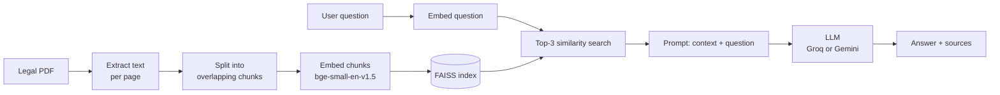

# ⚖️ Legal RAG Assistant


Ask questions about a legal PDF in plain English and get answers that are **grounded in the document itself**, with the source page shown next to every answer.

Upload a contract, lease or agreement, and the assistant finds the passages that matter, hands them to an LLM, and answers using only that text. If the document doesn't contain the answer, it says so instead of guessing.

## Features

- **Upload any text-based PDF** (contracts, leases, NDAs, policies) and start asking questions right away.
- **Answers grounded in your document.** The model is instructed to use only the retrieved text and to admit when the answer isn't there.
- **Source transparency.** Every answer lists the file and page it came from, and the retrieved passages can be expanded and read.
- **Two ways to use it.** A Streamlit web app and an interactive command-line chat.
- **Fast after the first question.** The PDF is indexed once per upload, and the vector index and embedding model are cached in memory.
- **Runs the retrieval side locally.** Embeddings and vector search run on your machine, and only the retrieved passages are sent to the LLM.

## How It Works



1. **Indexing** (`rag_index_builder.py`): the PDF is read page by page with PyMuPDF and split into 1,000-character chunks with 200 characters of overlap. Each chunk keeps its file name and page number, is turned into an embedding, and is saved in a FAISS index.
2. **Retrieval** (`tools.py`): the question is embedded with the same model, and the 3 most similar chunks are fetched from the index.
3. **Generation** (`app.py`, `main_chat.py`): the retrieved chunks and the question go into a prompt that tells the LLM to answer only from that context. The answer is shown together with its sources.

## Tech Stack

| Layer | Technology |
| --- | --- |
| Web UI | [Streamlit](https://streamlit.io/) |
| PDF parsing | [PyMuPDF](https://pymupdf.readthedocs.io/) |
| Chunking and vector store | [LangChain](https://www.langchain.com/) + [FAISS](https://github.com/facebookresearch/faiss) |
| Embeddings | [`BAAI/bge-small-en-v1.5`](https://huggingface.co/BAAI/bge-small-en-v1.5) via Hugging Face |
| LLM (web app) | [Groq](https://groq.com/) - `openai/gpt-oss-120b` |
| LLM (CLI) | [Google Gemini](https://ai.google.dev/) - `gemini-3.6-flash` |

## Project Structure

```text
legal-rag-assistant/
├── app.py                  # Streamlit web app (upload, ask, view sources)
├── main_chat.py            # Interactive command-line chat using Gemini
├── rag_index_builder.py    # PDF -> chunks -> embeddings -> FAISS index
├── tools.py                # Retrieval: load the index and fetch relevant chunks
├── docs/
│   └── sample_rental_agreement.pdf   # Sample document for trying it out
├── requirements.txt
├── .env.example            # Template for the API keys
└── rag_faiss_store/        # Generated FAISS index (git-ignored)
```

## Getting Started

### Prerequisites

- Python 3.10 or newer
- A [Groq API key](https://console.groq.com/keys) for the web app, and/or a [Google Gemini API key](https://aistudio.google.com/apikey) for the CLI. You only need the key for the interface you plan to use.

### Installation

```bash
git clone https://github.com/Vishal-Malik-code/legal-rag-assistant.git
cd legal-rag-assistant

python -m venv myenv

# macOS / Linux
source myenv/bin/activate
# Windows
myenv\Scripts\activate

pip install -r requirements.txt
```

### Configure your API keys

Copy the example file and fill in your keys:

```bash
cp .env.example .env
```

```text
GROQ_API_KEY=your_groq_api_key       # web app
GOOGLE_API_KEY=your_google_api_key   # command-line chat
```

> The first run downloads the embedding model (about 130 MB) from Hugging Face. After that it is cached locally.

## Usage

### Web app

```bash
streamlit run app.py
```

Open <http://localhost:8501>, upload a PDF, wait for "indexed successfully", then ask a question.

To try it without your own file, upload `docs/sample_rental_agreement.pdf` and ask, for example:

- *What is the monthly rent?*
- *What is the late fee if rent is paid after the 3-day grace period?*
- *How much is the security deposit?*

Each answer comes with its source (file name and page) and an expandable view of the exact passages the model was given.

### Command-line chat

The CLI answers from the index that already exists in `rag_faiss_store/`, so build one first. Running the builder indexes the sample PDF:

```bash
python rag_index_builder.py   # build the index (or upload a PDF in the web app)
python main_chat.py           # start chatting, type "exit" to quit
```

To inspect what the retriever returns for a question, without calling any LLM, run `python tools.py`.

## Configuration

| Setting | Where | Default |
| --- | --- | --- |
| Chunk size / overlap | `rag_index_builder.py` | 1000 / 200 characters |
| Chunks retrieved per question (`top_k`) | `tools.py` | 3 |
| Embedding model | `EMBEDDING_MODEL` in `rag_index_builder.py` and `tools.py` (keep both the same) | `BAAI/bge-small-en-v1.5` |
| Web app LLM | `MODEL_NAME` in `app.py` | `openai/gpt-oss-120b` (Groq) |
| CLI LLM | `MODEL_NAME` in `main_chat.py` | `gemini-3.6-flash` |

## Limitations

- **Text-based PDFs only.** Scanned documents (images) have no extractable text, and OCR is not included.
- **One document at a time.** Uploading a new PDF replaces the previous index.
- **Small retrieval window.** Only the top 3 chunks are passed to the LLM, so questions that need information from many parts of a long document may get incomplete answers. Increase `top_k` in `tools.py` if needed.
- **Chunks do not cross pages.** Text is split page by page so sources can show page numbers, which means a clause that continues onto the next page is split in two.
- **LLM calls need internet access.** The retrieval side runs locally, but the answer is generated by Groq or Gemini.

## Roadmap

- Support multiple documents with per-document filtering
- OCR for scanned PDFs
- Streaming answers and chat history in the web app

## Disclaimer

This project is for learning and demonstration. It does not provide legal advice, and its answers may be incomplete or wrong. Always check important details against the original document and consult a qualified professional.

## License

Released under the [MIT License](LICENSE).

## Author

**Vishal Malik** - [@Vishal-Malik-code](https://github.com/Vishal-Malik-code)
